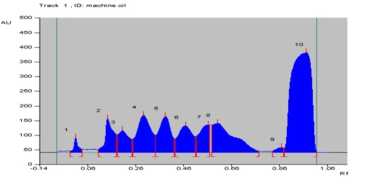
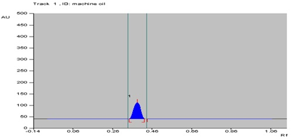
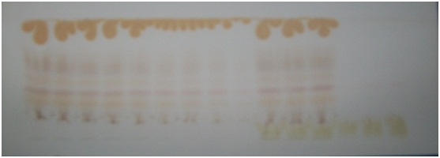
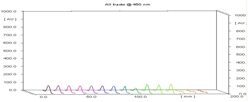
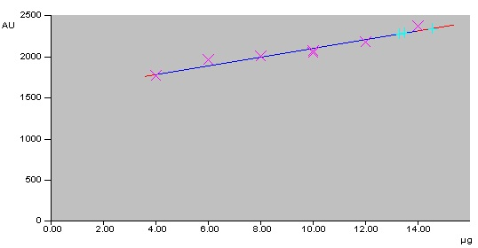

## Procedure

- A stock solution (40 mg/ml) of standard machine oil was prepared in n-Hexane and sonicated for 10 minutes over an ultrasonic bath.
- A 20cm × 10cm HPTLC plate coated with silica gel 60 F 254 and alumina 60 F 254 (E. Merck, Darmstadt, Germany) was used for analysis.
- The samples were applied at 10 mm from the base of HPTLC plate by means of a Camag (Switzerland) Linomat V sample applicator using a syringe (100µL, Hamilton, Bonaduz, Switzerland).
- As oil sample is mixture of different components, so major peak is considered for the study.
- A linear calibration curve was obtained on applying the increasing concentration of standard machine oil in the range (2-16 µg).
- HPTLC analysis was performed on a computerized densitometer scanner 3, controlled by WinCATS planar chromatography manager version 1.4.4. (CAMAG, Switzerland).
- Plate was developed to a distance of 80 mm, in a Camag twin-trough chamber with mobile phase [n-Hexane: Diethyl ether: MeOH:: 7:2:1.5 (v/v)].
- Plates were derivatized using 5% sulphuric acid solution in methanol.
- Plates were evaluated by densitometry at 450 nm with a Camag Scanner 3 for quantification.

## Observation

The chromatographic profile of the sample was simple, showing different peaks of Machine oils (Fig. 1) but we select the sharp and major peak (Fig. 2). Machine oil is not UV active, so the plates were derivatized using the 5 % sulphuric acid in methanol (Fig. 3). Peak of machine oil was identified using the solvent system [n-Hexane: Diethyl ether: MeOH:: 7:2:1.5 (v/v)] with the Rf value of 0.38 ± 0.02 at 450 nm (Fig. 4). Table 1 shows the appearance of different peaks in machine oil and their Rf values.

   
  <strong>Fig. 1: Chromatogram of machine oil</strong>
    
  <strong>Table 1: Peaks of machine oil and their Rf value</strong>
    

| Peak No. | Rf |
|----------|---------------|
| 1        | 0.04          |
| 2        | 0.09          |
| 3        | 0.16          |
| 4        | 0.32          |
| 5        | 0.38 (Substance 1) |
| 6        | 0.46          |
| 7        | 0.53          |
| 8        | 0.57          |
| 9        | 0.86          |
| 10       | 0.91          |

  
   
  <strong>Fig. 2: Chromatogram of substance 1 (Rf = 0.38) of machine oil</strong>
     
   
  <strong>Fig. 3: Derivatized image of machine oil + sample</strong>
     
   
  <strong>Fig. 4: 3D display of substance 1 of machine oil peaks</strong>
    

The linearity of the proposed method was confirmed in the range of 2-16 µg of substance 1 for machine oil. A linear regression of the data points for substance 1 is resulted in a calibration curve with the equation Y = 1569.021 + 53.047x [regression coefficient (r2) = 0.96790, standard deviation (S.D.) = 2.52%] (Fig. 5). Substance 1 content in milk samples were calculated and depicted in Table 2.

   
  <strong>Fig. 5: Calibration curve of substance 1 in machine oil</strong>
    
  <strong>Table 2: Substance 1 content in milk samples</strong>
    

| Milk Samples (%) | Substance 1 (%) | SD (%) |
|------------------|-----------------|--------|
| Pure Milk        | 0 (naturally occurring) | - |
| Milk sample 1    | 0.32            | ± 0.05 |
| Milk sample 2    | 0.40            | ± 0.07 |
| Milk sample 3    | 0.49            | ± 0.02 |

The linearity, accuracy in terms of recovery % and precision was considered for the method. Validation of the method at three concentration levels was carried out by the standard recovery formula returned a mean of 85%. Precision (repeatability) was determined by running a minimum of four analyses and the coefficient of variability was found to be 0.365 %. The limit of detection (LOD) and quantification (LOQ) was found to be 0.156 and 0.475 µg respectively.
